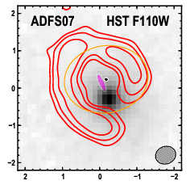

Plot the Best-fit Model
***********************

The second step is to plot the best-fit model and make sure that the model
accurately reproduces the data.  You can do this using
:func:`visualize.bestFit`.

Some Preliminaries
------------------

.. Caution::

    You must run :func:`visualize.bestFit` from inside a CASA terminal OR you
    must install MIRIAD and add the following line to config.yaml::
    
        UseMiriad: True

.. Note::
    To run :func:`visualize.bestFit` from inside CASA, follow these steps

        #. Install `casa-python
           <https://github.com/radio-astro-tools/casa-python>`_.  This
           makes it easy to install custom python packages in CASA
           using pip.

        #. Install ``pyyaml`` and ``astropy`` into your CASA python environment.

           * ``casa-pip install pyyaml``
           * ``casa-pip install astropy``

        #. Inspect $HOME/.casa/init.py and ensure that it contains a link to
           the directory where ``pyyaml`` and ``astropy`` were installed.  In
           my case, the file already had the following:

           import site
           site.addsitedir("/Users/rbussman/.casa/lib/python2.7/site-packages")

           So, I had to add the following lines:

           site.addsitedir("/Users/rbussman/.casa/lib/python/site-packages")
           site.addsitedir("/Users/rbussman/python/uvmcmcfit")

           This allowed CASA to recognize that ``pyyaml`` and ``uvmcmcfit``
           were installed.  You may have placed ``uvmcmcfit`` in a different
           directory, so modify these instructions accordingly.

.. Note::

    To install MIRIAD on Mac, try the `MIRIAD MacPorts page
    <https://www.cfa.harvard.edu/~pwilliam/miriad-macport/>`_

.. Caution::

    If you use MIRIAD to make images of the best-fit model, you must create a
    special cshell script called *image.csh*.  This file should contain the
    instructions needed for MIRIAD to invert and deconvolve the simulated
    visibilities from the best-fit model.

The Simplest Best-fit Plot
--------------------------

Generating a simple plot of the best-fit model should be straightforward::

    import visualize
    visualize.bestFit()

If you run this routine in CASA, you will enter an interactive cleaning
session.

.. Note:: 

    See this `ALMA tutorial
    <http://casaguides.nrao.edu/index.php?title=AntennaeBand7_Imaging_4.2>`_
    for help on interactive cleaning.  

After the cleaning session finishes, two plots will be produced like
the ones shown below.

.. image:: media/ADFS07_LensedSBmap.Region0.model.bestfit.png 

.. image:: media/ADFS07_LensedSBmap.Region0.residual.bestfit.png

*Left panel:* ALMA 870um imaging of ADFS07 (red contours, starting at
+/-3-sigma and increasing by factors of sqrt(2)) overlaid on the best-fit model
from ``uvmcmcfit`` (grayscale).  The half-power shape of the source ``Source0``
in this case, is shown by a magenta ellipse.  The shape of the synthesized beam
is represented by the hatched black ellipse.

*Right panel:* Same as left panel, but showing the residual image after
subtracting the best-fit model simulated visibilities from the observed
visibilities.  White and black contours trace positive and negative contours,
respectively.

In this case, the model provides a good fit.  There is evidence that the source
is elongated in a direction perpendicular to the semi-major axis of the
synthesized beam.

Comparison to Alternative Imaging
---------------------------------

You can also compare the best-fit model to an image at an alternative
wavelength (e.g., to compare lens properties with an optical or near-IR image
of the lens).  Do this by adding the following keyword::

    visualize.bestFit(showOptical=True)

You should get the same results as above, but with an additional plot showing
the comparison with the alternative image.  Below is an example comparing the
ALMA 870um imaging and best-fit model with *HST* F110W imaging. 

Here, the postion of the lens according to the best-fit model is offset from
the position of the lens according to the *HST* image by ~0.6 arcsec.  The
astrometry in the *HST* image is tied to a Gemini-South optical image of this
source to ~0.1 arcsec rms precision.  However the Gemini-South image astrometry
is tied to 2MASS imaging and therefore has an absolute uncertainty of ~0.5
arcsec rms.  So this result is a little farther off than we might expect, but
it's not worth losing sleep over.  Data from the `VISTA Hemisphere Survey
<http://www.ast.cam.ac.uk/~rgm/vhs/>`_ (VHS) will be helpful for this
application due to the deeper imaging and better image quality of the VHS.

.. image:: media/ADFS07_LensedSBmap.Region0.model.bestfit.png 

.. image:: media/ADFS07_LensedSBmap.Region0.residual.bestfit.png

Additional Options
------------------

You can turn off interactive cleaning in CASA::

    visualize.bestFit(interactive=False)

:func:`visualize.bestFit` produces a large number of intermediate stage files
that are automatically deleted as the last step in the program.  These can
sometimes be useful for debugging.  To stop the program from automatically
deleting all intermediate files, use the following option::

    visualize.bestFit(cleanup=False)
