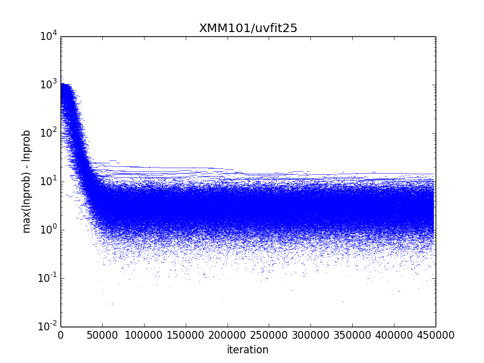

Testing Convergence
*******************

The first step in determining whether you have an acceptable model is to plot
the convergence profile of the goodness of fit estimate (by default, the
maximum likelihood estimate).  You can do this using
:func:`visualize.convergence` ::

    import visualize
    visualize.convergence()

This routine produces *convergence.png*, a plot of the difference between
max(lnprob) and lnprob as a function of iteration.  This turns out to be a
convenient way to visualize the convergence, but it does mean that the best-fit
model is shown at the bottom of the plot.

For XMM101, I needed about 50,000 iterations to reach convergence.  The worst
model fit has max(lnprob) - lnprob ~ 2e3.  Both values are fairly typical for
a single unlensed source like XMM101.

