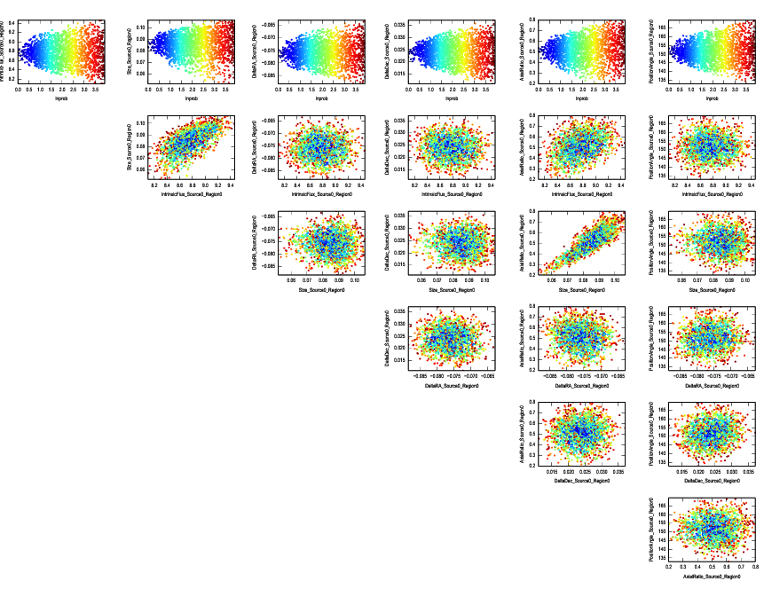

Plot the Covariance Matrix
**************************

You might wish to examine how the various parameters are correlated with each
other.  You can do this by plotting the covariance matrix using
:func:`visualize.covariance`::

    import visualize
    visualize.covariance()

This should produce a plot which looks similar to the image below.  There
appears to be a strong correlation between the axial ratio, size, and total
flux density of the source.

